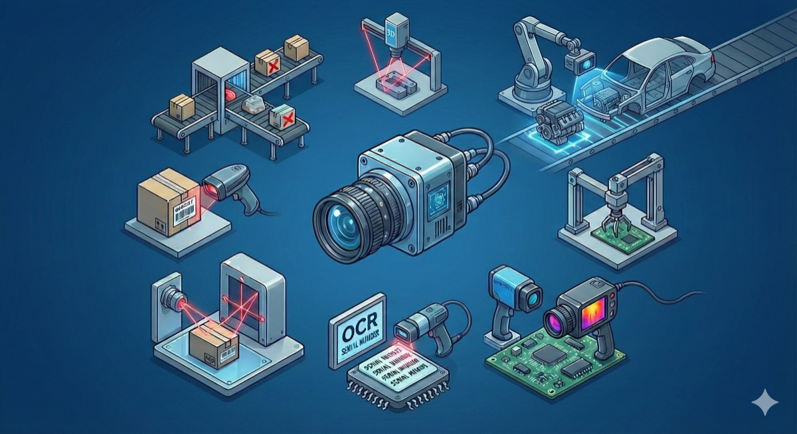
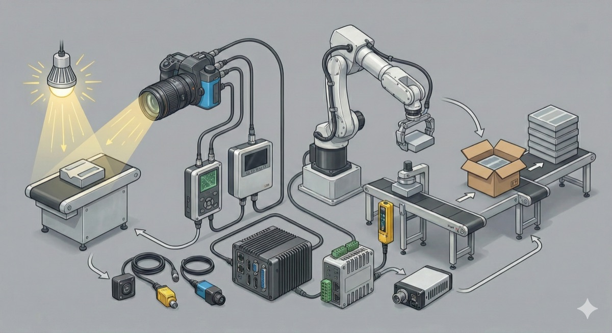
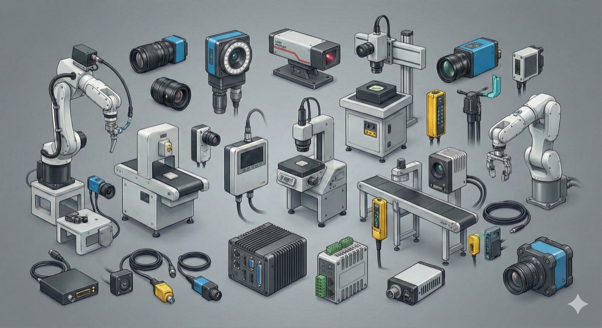

The Machine Vision market is not a monolith; it is a highly specialized, **tier-based ecosystem** designed to convert raw light into actionable industrial data.

## Market Structure Overview

    

    

        
⚗️

        <h3 style="font-weight: 700; margin-bottom: 0.5rem;">Fragmentation & Specialization</h3>
        
Unlike consumer electronics, no single company owns the entire stack. A lens expert (e.g., Fujinon) rarely makes software, and a software expert (e.g., MVTec) rarely builds robots. This necessitates a strong network of <strong>partnerships and integration</strong>.

    

    

        
🧩

        <h3 style="font-weight: 700; margin-bottom: 0.5rem;">The Integration Gap</h3>
        
Vision systems are not "plug and play" like a webcam. They require precise lighting, calibration, and logic programming. This complexity creates a massive market for <strong>System Integrators (SIs)</strong> who bridge the gap between hardware makers and factories.

    

    

        
⚙️

        <h3 style="font-weight: 700; margin-bottom: 0.5rem;">From Pixels to Decisions</h3>
        
The value chain moves linearly: <strong>Component</strong> (Capture) → <strong>System</strong> (Process) → <strong>Application</strong> (Decide). The industry is currently shifting value from hardware commoditization to software/AI intelligence.

    

---

## The Value Chain: From Photon to Factory

Click any stage to understand its specific function, market dynamics, and operational context.

    

    <button data-stage="components" onclick="mvUpdateChain('components')" class="mv-chain-step">
        
Step 1

        
Component

        
Sensors & Optics

    </button>
    <button data-stage="systems" onclick="mvUpdateChain('systems')" class="mv-chain-step">
        
Step 2

        
Vision System

        
Cameras & Software

    </button>
    <button data-stage="distribution" onclick="mvUpdateChain('distribution')" class="mv-chain-step">
        
Step 3

        
Distribution

        
Channel Partners

    </button>
    <button data-stage="integrators" onclick="mvUpdateChain('integrators')" class="mv-chain-step">
        
Step 4

        
Integrator

        
Machine Builders

    </button>
    <button data-stage="endusers" onclick="mvUpdateChain('endusers')" class="mv-chain-step">
        
Step 5

        
End User

        
Industrial Clients

    </button>

    <!-- Content injected by JS -->

---

## Global Market Leaders

Neutral ranking of the dominant players in Hardware, Software, and System Integration.

    

    <button onclick="mvShowLeaders('hardware')" id="mv-tab-hardware" class="mv-tab-btn active">Hardware</button>
    <button onclick="mvShowLeaders('software')" id="mv-tab-software" class="mv-tab-btn">Software</button>
    <button onclick="mvShowLeaders('integrators')" id="mv-tab-integrators" class="mv-tab-btn">Integrators</button>

    

        <table class="mv-table">
            <thead>
                <tr>
                    <th>Company</th>
                    <th>HQ Location</th>
                    <th>Primary Expertise</th>
                    <th>Strategic Market Focus</th>
                </tr>
            </thead>
            <tbody id="mv-leader-table">
                <!-- Rows injected by JS -->
            </tbody>
        </table>
    

